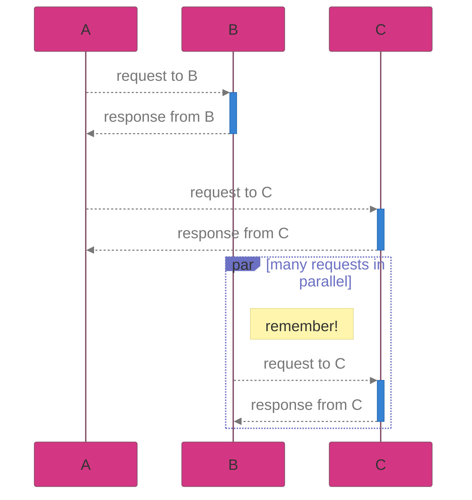

+++
title = "Mermaid diagrams on GitHub"
author = ["Sam Pillsworth"]
date = 2024-09-18T09:32:00-04:00
tags = ["reference", "mermaid", "github"]
draft = false
creator = "Emacs 29.2 (Org mode 9.8 + ox-hugo)"
+++

While working on a sequence diagram for a particular flow I lost a lot of time
trying to get a mermaid sequence diagram to not look chaotic, to not be so tiny
on my small laptop, and to have cute colours. I'm saving this for future
reference.

## Notes about this config, in no particular order {#notes-about-this-config-in-no-particular-order}

-   I couldn't get `background` to work on GitHub to set a specific colour for the display window
    -   This is why I had to set the font colour to a midtone grey, to try to support both a light and dark background
-   the `  ` adds some visual space, so that a request and it's response are clustered together compared to distinct requests
-   the `par` box &amp; border are controlled by the label variables, the action text is controlled by the loop text colour
-   `fontSize` is changed at the top level, NOT inside the theme variables

## Screenshots {#screenshots}

This is what the above sequence diagram looks like in dark mode and light mode on GitHub:




